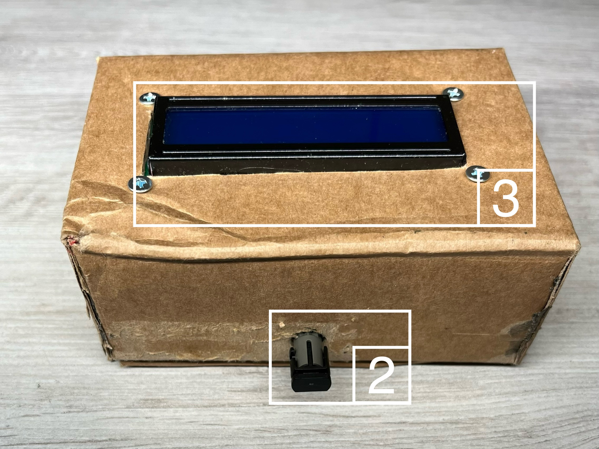

# Introduction

This project utilizes readily available optoelectronic components: the **HFBR-1414Z** transmitter and **HFBR-2412Z** receiver, both operating at approximately **820 nm**. Data is transmitted over optical fiber terminated with **ST connectors**.

**How it works**:
- Text data is sent from a **computer** via **serial interface** to an **Arduino Nano** connected to the transmitter.
- The **optical signal** travels through fiber to the **receiver**, connected to another Arduino Nano.
- The data is then displayed on a **16x2 LCD module**.

**Key features**:
- Powered entirely via **USB**
- Minimal assembly
- Ideal hands-on intro to **fiber optic systems**

---

# User Manual

## Transmitter

### Connector Description

The fiber optic transmitter is shown in the figure below and includes the following connectors:

1. Power and data connector (USB) – for communication with a computer.  
2. Fiber optic connector with an ST-type socket.


### Startup and Configuration

To start the transmitter:

- Connect it to a computer via USB.
- Plug the fiber optic cable into connector no. 2.

In the top-left corner of the Arduino IDE, there is a device selection menu – click it and choose **"Arduino NANO"**, as shown below:


Then open the **Serial Monitor**, located in the top bar:


Once the Serial Monitor is open, set the following:

- **Baud Rate**: `9600 baud`  
- **Line Ending**: `"NEW LINE"` (`\n` – newline character)


---

## Receiver

### Connector Description

The fiber optic receiver is shown in the figures below. It includes:

1. Power and data connector (USB).
2. Fiber optic connector with an ST-type socket.
3. LCD display.

 

### Startup

To start the receiver:

- Connect the other end of the fiber optic cable to connector no. 2.
- Connect the receiver to a power source or computer using a mini USB cable via connector no. 1.

If the receiver starts correctly, the LCD will display:

```
Waiting for a msg.
```


---

## Data Transmission

To send data to the transmitter, you can use any serial communication software (e.g., **PuTTY**), but **Arduino IDE** is recommended.

If the transmitter is correctly configured, the following message will appear:

```
Waiting for input...
```


You can enter your message in the `"Messeage"` text field, shown below:


For example, you can type:

```
Hello World!
```


The transmitted message will be displayed on the receiver’s LCD:


